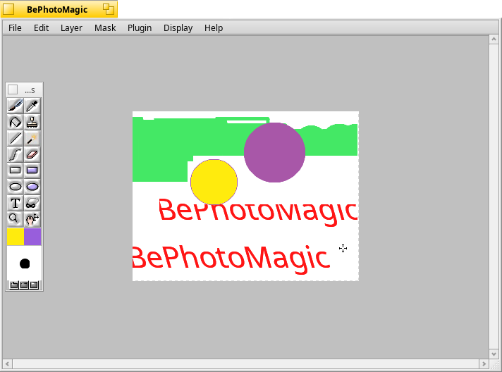

BePhotoMagic
============

BePhotoMagic is a resurrection of the abandoned Photon project and is intended to be a Photoshop-quality paint and image processing for BeOS.

License: GNU General Public License version 2.0 (GPLv2)  
Original Site: http://sourceforge.net/projects/bpmagic/
