BePhotoMagic
============

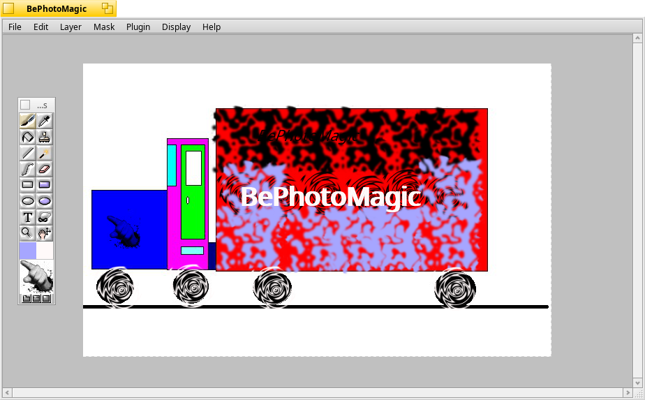

It is fun to paint different images and shapes using the the BePhotoMagic features in Haiku. It was a application developed by DarkWyrm to resurrect the abandoned Photon Project. It is a place to display your painting abilities. But in most of the cases, lack of knowledge about the software and its tools leave us helpless. You can find the different aspects of BePhotoMagic so that you can enjoy your painting to the fullest.

BePhotoMagic provides the following basic tools: 

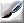 Paintbrush: Draw with whatever is displayed in the brush view.

 Fill: Click on a pixel and all neighboring pixels like it will also be changed to the new color.

 Line: Paints a line using the current brush.

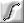 Spline: This does not work yet. When it does, you will be able to easily draw curved lines.

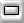 Rectangle: Draw a rectangle or square using the current brush.

 Ellipse: Draw an ellipse or circle with the current brush.

 Text: Brings up the text window.

 Zoom: One of the several ways of zooming in or out on the image.

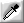 Eyedropper: Click on a pixel in the image with either mouse button and the current foreground or background color will become that color.

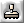 Stamp: Copy part of the image to another part of the image. The right mouse button will choose the part of the image to copy from. The left mouse button paints. Otherwise, it operates just like the Paintbrush tool.

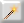 Magic Wand: Operates just like the Fill tool except that colors are selected. 

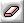 Eraser: Places you in erase mode. When in erase mode, the regular tools erase instead of draw. Filters will also erase.

 Filled Rectangle: Like Rectangle, but the rectangle is filled in.

 Filled Ellipse: Like Ellipse, but the ellipse is filled in.

 Mask: Places you in Mask mode, allowing you to edit the selection with any of the tools or filters.

Below are few screenshots, explaining the basic features of the application:

Create:

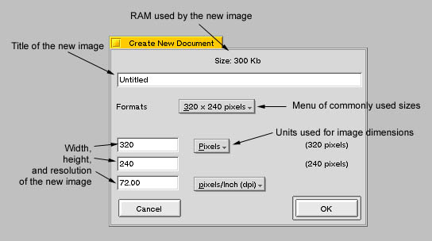

Brushes:

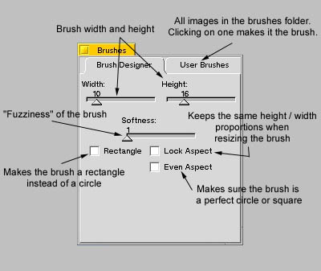

Filter:

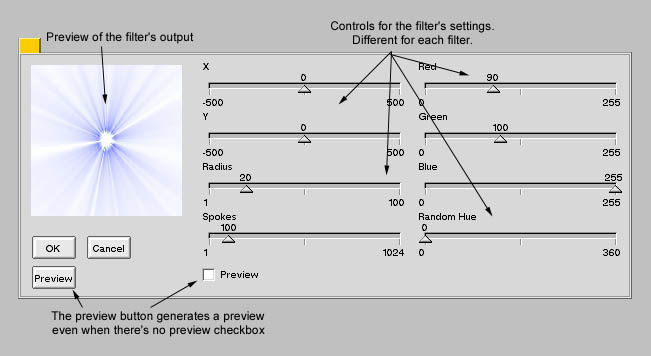

Layers:

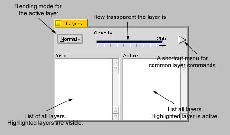

Text Tool:

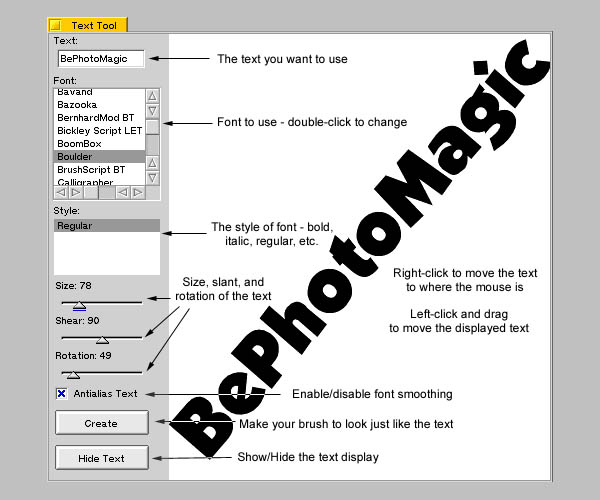

License: GNU General Public License version 2.0 (GPLv2)
